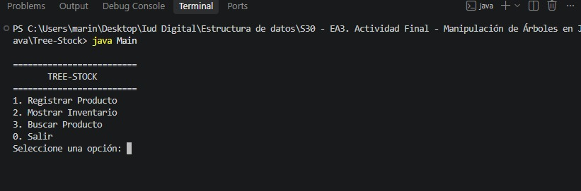
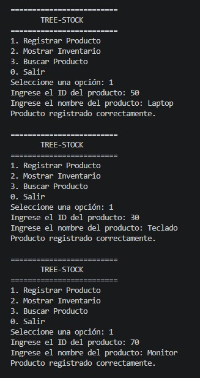
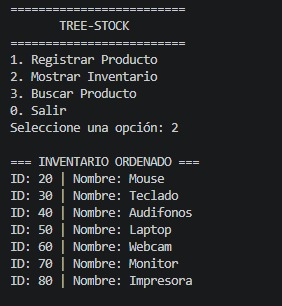
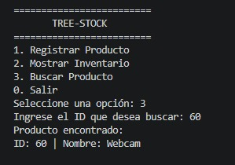

# Tree-Stock — Sistema de Inventario con Árbol Binario de Búsqueda

## 1. Introducción

Tree-Stock es un sistema de inventario desarrollado en Java como actividad final de la asignatura Estructura de Datos.

El proyecto implementa un Árbol Binario de Búsqueda (ABB) para registrar, organizar y consultar productos mediante su identificador numérico.

A diferencia de una estructura lineal, el árbol permite organizar los elementos de acuerdo con su ID, utilizando referencias entre nodos y métodos recursivos para realizar las operaciones principales.

---

## 2. Objetivo

Comprender el funcionamiento de los Árboles Binarios de Búsqueda (ABB) y aplicar esta estructura de datos en un sistema de inventario desarrollado en Java.

El sistema permite:

- Registrar productos.
- Organizar los productos mediante su ID.
- Mostrar el inventario ordenado.
- Buscar productos mediante su ID.
- Evitar el registro de identificadores duplicados.

---

## 3. Objetivos específicos

- Implementar un nodo utilizando la clase `Producto`.
- Crear un Árbol Binario de Búsqueda mediante la clase `ArbolInventario`.
- Utilizar referencias para conectar los nodos del árbol.
- Implementar la inserción de productos mediante recursividad.
- Implementar un recorrido inorden.
- Implementar una búsqueda recursiva por ID.
- Validar que no se registren productos con identificadores repetidos.
- Crear una interfaz de consola mediante un menú interactivo.
- Utilizar Git y GitHub para llevar el control del desarrollo del proyecto.

---

## 4. Fundamento teórico

### 4.1 Árbol

Un árbol es una estructura de datos no lineal formada por nodos relacionados mediante referencias.

En un árbol se pueden identificar diferentes elementos:

- Raíz: primer nodo del árbol.
- Nodo: elemento que contiene información.
- Hijo izquierdo: referencia hacia un nodo descendiente.
- Hijo derecho: referencia hacia un nodo descendiente.
- Hoja: nodo que no posee hijos.
- Subárbol: parte del árbol que comienza en un nodo determinado.

### 4.2 Árbol Binario

Un árbol binario es una estructura en la que cada nodo puede tener como máximo dos hijos.

```text
              Nodo
             /    \
            /      \
  Hijo izquierdo  Hijo derecho
```

En Tree-Stock cada objeto de la clase `Producto` funciona simultáneamente como producto y como nodo del árbol.

### 4.3 Árbol Binario de Búsqueda

El Árbol Binario de Búsqueda (ABB) organiza sus elementos utilizando una regla basada en el valor de la clave.

Para Tree-Stock se utiliza el ID del producto:

```text
             ID
            /  \
        Menor  Mayor
```

La regla utilizada es:

- Los ID menores se almacenan en el subárbol izquierdo.
- Los ID mayores se almacenan en el subárbol derecho.
- Los ID duplicados no son permitidos.

Por ejemplo, al insertar los siguientes productos:

```text
50 → Laptop
30 → Teclado
70 → Monitor
20 → Mouse
40 → Audifonos
60 → Webcam
80 → Impresora
```

El árbol queda organizado de la siguiente manera:

```text
                  50
                /    \
              30      70
             /  \    /  \
           20   40  60   80
```

### 4.4 Recorrido inorden

El recorrido inorden visita los nodos siguiendo este orden:

```text
Izquierda → Raíz → Derecha
```

En un Árbol Binario de Búsqueda, este recorrido permite obtener los elementos ordenados de menor a mayor según su clave.

Para el árbol utilizado en Tree-Stock:

```text
20 → 30 → 40 → 50 → 60 → 70 → 80
```

Por esta razón, la opción Mostrar Inventario presenta los productos ordenados por ID.

### 4.5 Recursividad

La recursividad se utiliza en las operaciones principales del árbol.

Durante una inserción o búsqueda, el método analiza el nodo actual y decide si debe continuar por el subárbol izquierdo o por el derecho.

Por ejemplo:

```text
             50
            /  \
          30    70

Buscar 30:

30 < 50
↓
ir al hijo izquierdo
↓
30 encontrado
```

Este proceso continúa hasta encontrar el elemento o llegar a una referencia `null`.

---

## 5. Estructura del proyecto

El proyecto está compuesto por exactamente las tres clases solicitadas:

```text
Tree-Stock/
│
├── Producto.java
├── ArbolInventario.java
├── Main.java
├── README.md
├── .gitignore
│
└── img/
    ├── captura-menu.png
    ├── captura-insercion.png
    ├── captura-inventario.png
    └── captura-busqueda.png
```

---

## 6. Descripción de las clases

### 6.1 Producto.java

La clase `Producto` representa tanto la información del producto como un nodo del árbol.

Contiene:

```java
int id;
String nombre;
Producto izquierdo;
Producto derecho;
```

Las referencias `izquierdo` y `derecho` permiten conectar el nodo con sus respectivos hijos.

Inicialmente estas referencias tienen el valor:

```java
null
```

Esto significa que el producto comienza sin hijos.

### 6.2 ArbolInventario.java

Esta clase contiene la lógica principal del Árbol Binario de Búsqueda.

Su atributo principal es:

```java
private Producto raiz;
```

La raíz representa el primer nodo del árbol.

La clase implementa las siguientes operaciones:

#### Insertar

```java
insertar(int id, String nombre)
```

Registra un nuevo producto y determina su posición dentro del árbol.

La comparación se realiza mediante el ID:

```text
ID menor → izquierda
ID mayor → derecha
ID igual → no se permite
```

La inserción se realiza mediante el método recursivo:

```java
insertarRecursivo(...)
```

#### Mostrar inventario

```java
mostrarInventario()
```

Utiliza un recorrido inorden para mostrar los productos ordenados por ID.

El método utilizado internamente es:

```java
recorridoInorden(...)
```

#### Buscar

```java
buscar(int id)
```

Permite localizar un producto utilizando su identificador.

La búsqueda utiliza el método recursivo:

```java
buscarRecursivo(...)
```

Si el producto existe, devuelve el objeto `Producto`.

Si no existe, devuelve:

```java
null
```

### 6.3 Main.java

La clase `Main` contiene la interfaz de consola del sistema.

El usuario puede seleccionar entre las siguientes opciones:

```text
=========================
       TREE-STOCK
=========================
1. Registrar Producto
2. Mostrar Inventario
3. Buscar Producto
0. Salir
Seleccione una opción:
```

La interacción se realiza mediante `Scanner`.

También se implementó el método:

```java
leerEntero(...)
```

para controlar entradas que no sean números enteros y evitar que el programa termine inesperadamente.

---

## 7. Funcionamiento del sistema

### 7.1 Registrar producto

El usuario selecciona:

```text
1. Registrar Producto
```

Luego introduce:

```text
ID del producto
Nombre del producto
```

Por ejemplo:

```text
Ingrese el ID del producto: 50
Ingrese el nombre del producto: Laptop
Producto registrado correctamente.
```

El producto se incorpora al árbol respetando las reglas del ABB.

### 7.2 Control de identificadores duplicados

El sistema verifica si el ID ya existe antes de realizar la inserción.

Por ejemplo, si ya existe:

```text
ID: 50 | Nombre: Laptop
```

y se intenta registrar nuevamente el ID `50`, el sistema muestra:

```text
No se registró el producto: el ID 50 ya existe.
```

De esta manera cada producto posee un identificador único dentro del árbol.

### 7.3 Mostrar inventario

Al seleccionar:

```text
2. Mostrar Inventario
```

se realiza un recorrido inorden.

Con los productos registrados:

```text
50 Laptop
30 Teclado
70 Monitor
20 Mouse
40 Audifonos
60 Webcam
80 Impresora
```

el sistema muestra:

```text
20 Mouse
30 Teclado
40 Audifonos
50 Laptop
60 Webcam
70 Monitor
80 Impresora
```

Esto demuestra el funcionamiento del recorrido inorden sobre el ABB.

### 7.4 Buscar producto

Al seleccionar:

```text
3. Buscar Producto
```

el usuario introduce el ID que desea consultar.

Por ejemplo:

```text
Ingrese el ID que desea buscar: 60
```

Si existe:

```text
Producto encontrado:
ID: 60 | Nombre: Webcam
```

Si no existe:

```text
No existe un producto con el ID 99.
```

---

## 8. Validaciones implementadas

El sistema incluye diferentes validaciones para mejorar su funcionamiento:

- No permite registrar IDs duplicados.
- No permite nombres de productos vacíos.
- Controla entradas que no sean números enteros.
- Informa cuando un producto no existe.
- Informa cuando el inventario está vacío.
- Controla opciones inválidas del menú.

---

## 9. Tecnologías utilizadas

- Java.
- Eclipse Temurin JDK.
- Visual Studio Code.
- Git.
- GitHub.
- PowerShell / Terminal.

No se utilizaron estructuras de árboles proporcionadas por librerías externas. La estructura del Árbol Binario de Búsqueda fue implementada manualmente mediante referencias entre objetos y métodos recursivos.

---

## 10. Ejecución del proyecto

### Requisitos

Se necesita tener instalado:

- Java JDK.
- Visual Studio Code u otro editor compatible.
- Terminal o PowerShell.

### Compilación

Desde la carpeta del proyecto ejecutar:

```powershell
javac *.java
```

Si la compilación es correcta, no se mostrará ningún mensaje de error.

### Ejecución

Después de compilar:

```powershell
java Main
```

Se mostrará el menú principal de Tree-Stock.

---

## 11. Evidencias de funcionamiento

### Menú principal

El sistema presenta las opciones disponibles para administrar el inventario.



### Registro de productos

Se pueden registrar productos indicando su ID y nombre.



### Inventario ordenado

El recorrido inorden permite mostrar los productos organizados de menor a mayor según su ID.



### Búsqueda de productos

El sistema permite consultar un producto mediante su ID.



---

## 12. Control de versiones

El desarrollo del proyecto se realizó utilizando Git y GitHub.

Los principales cambios realizados durante el desarrollo fueron:

```text
ff63b5c Crear estructura inicial de Tree-Stock
448e47a Implementar nodo Producto
485c49e Implementar árbol binario de búsqueda
f92e0ef Validar identificadores duplicados en el inventario
67f3855 Agregar evidencias de ejecución
```

Estos commits permiten observar la evolución progresiva del proyecto, desde la creación de la estructura inicial hasta la implementación de las funcionalidades principales y las evidencias de funcionamiento.

Repositorio:

https://github.com/andreseduardovega/S30---EA3.-Actividad-Final---Manipulaci-n-de-rboles-en-Java

---

## 13. Video de explicación individual

En el video se explicará el funcionamiento del Árbol Binario de Búsqueda y, especialmente, la lógica utilizada para conectar los nodos mediante las referencias `izquierdo` y `derecho`.

También se explicará:

- Cómo se crea la raíz.
- Cómo se insertan nuevos productos.
- Cómo se determina si un nodo debe ubicarse a la izquierda o derecha.
- Cómo funciona el recorrido inorden.
- Cómo se realiza la búsqueda recursiva.
- Cómo se controlan los identificadores duplicados.

### Enlace al video

[Ver video de explicación individual](https://drive.google.com/file/d/1QrtZL0t1NOydrXxFH5T9FZ2dL-nugyYx/view?usp=sharing)

---

## 14. Conclusiones

El desarrollo de Tree-Stock permitió aplicar de manera práctica los conceptos relacionados con los Árboles Binarios de Búsqueda.

La implementación demuestra cómo una estructura no lineal puede utilizar referencias entre objetos para organizar información de acuerdo con una clave.

La utilización de la recursividad permitió implementar las operaciones de inserción, búsqueda y recorrido del árbol siguiendo directamente la estructura de los subárboles.

El recorrido inorden también permitió comprobar una de las características principales de un ABB: obtener los elementos ordenados según su clave.

Finalmente, el proyecto permitió integrar los conceptos de estructuras de datos con Java, control de versiones mediante Git y documentación del desarrollo mediante GitHub.

---

## 15. Autor

**Andrés Vega**

Proyecto académico para la asignatura:

**Estructura de Datos**

Sistema:

**Tree-Stock**
